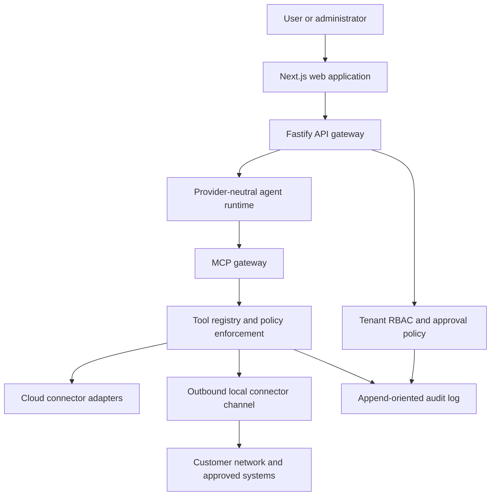

# Architecture

The initial deployment is a modular monolith. Package boundaries isolate policy, MCP, persistence, and connector contracts without introducing operationally expensive microservices. The local connector is a separate process because it runs inside a customer-controlled network.

## Decisions

- Tenant ownership is explicit in all business aggregates; API repositories must require `organizationId` rather than accepting optional tenant filters.
- The tool registry is the single execution choke point. MCP is an adapter and cannot execute connector functions directly.
- Writes and reads have distinct metadata. Approval is checked after authorization and before connector execution.
- Audit records restrict organization deletion rather than cascading evidence.
- SDK target: official TypeScript MCP SDK v2 and the 2026-07-28 protocol line.
